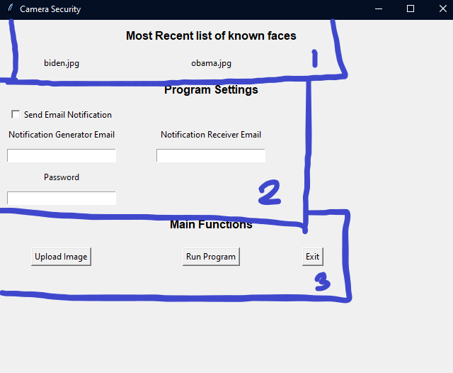
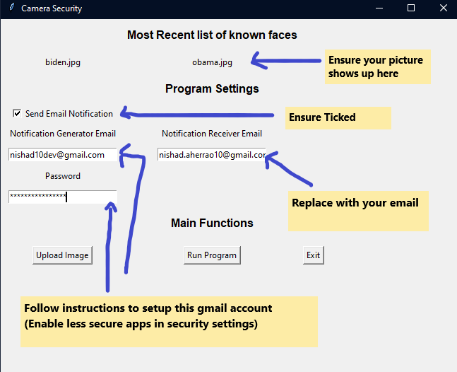
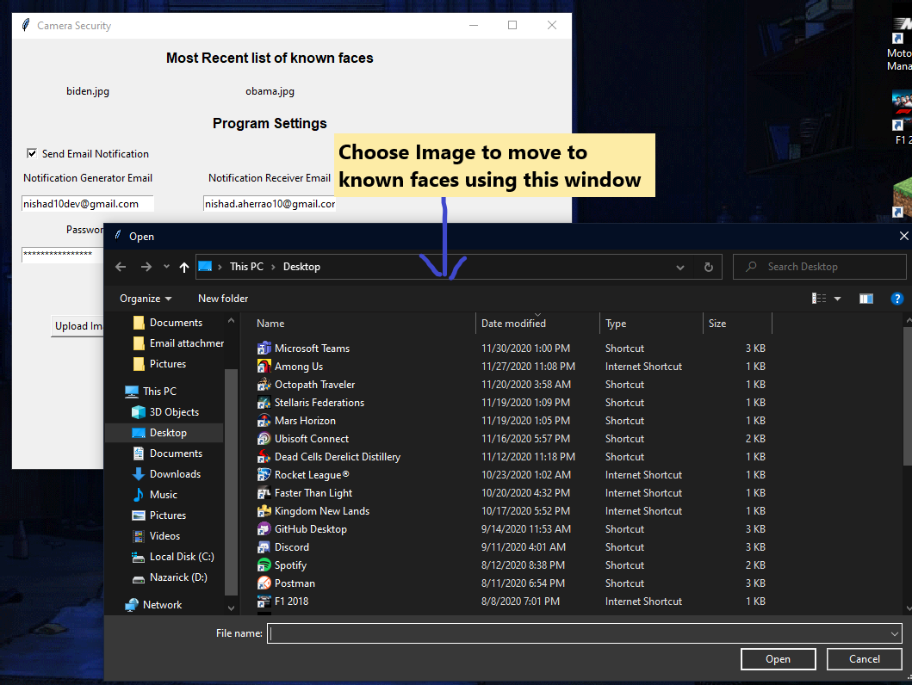
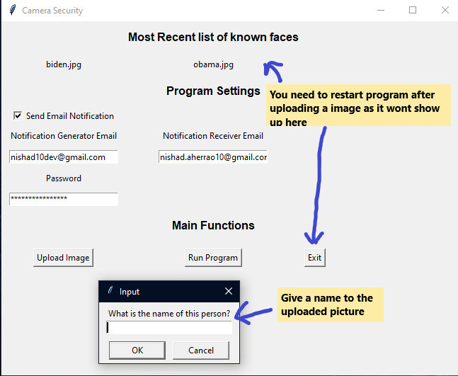
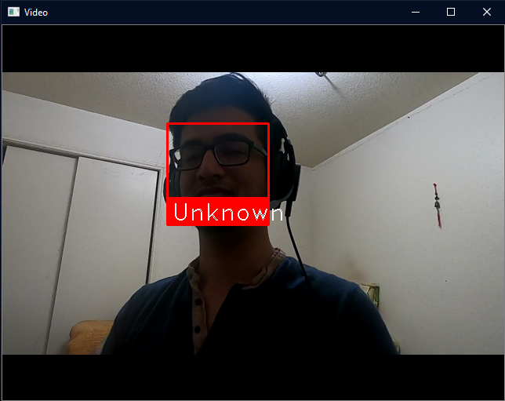

# faceRecognitionSecurity
Using pre-built face recognition  models to identify presence of strangers using a camera. 

We notify the user via email if unknown face is encountered in the video.

Check out Program Instructions Runtime below to learn more on how to use the program after Installation.

Built using face recognition model from here :-

https://github.com/ageitgey/face_recognition

## Installation

Here is a simple installation guide that worked for us (It might change for you depending on what programs/libraries you are missing)

Make sure you go through preparation before moving on to Library/Module installation

### Preparation
1. Make sure you have python v3.0+
2. Make sure you have cmake installed.
3. Make sure you have dlib installed

Depending on your operating system the instructions might vary

For python check out - https://www.python.org/downloads/

For cmake check out - https://cmake.org/install/
> There are precompiled binaries for windows as well as mac/linux that you can download and run to install cmake.

- For pip one thing to keep in mind is your path should be properly setup so that pip is recognized if you face issues try doing this -
`python3 -m pip install` or `python -m pip install` instead of doing `pip install`

For dlib installation do 
` pip install dlib `

Now that we have met all requirements we will download and install all libraries used in the program.

### Libraries/Modules Installation

Use pip3 instead of pip if thats what you have setup for v3.0+

Install face_recognition library
` pip install face_recognition`

Install cv2
`pip install opencv-python`

Install numpy
`pip install numpy`

We have a few other modules imported in the program, these are and should be a part of your standard library and should come installed by default.
If you face any errors after running the above errors please take a look at what library you are missing and refer to docs to intall it using `pip`

## Program Instructions Runtime

### On cloning and installation, when you run the program this is what you should see.

You need to add your picture to known faces or the program wont recognize you. Also we need to setup Email settings if we want to receive email notifications.

### Get ready to upload your picture to list of known images and setup email

**!!EMAIL IMPORTANT!!**

To make sure you can send email properly the gmail account used to send email notifications need to have less secure apps enabled. To do this

**!!EMAIL IMPORTANT!!**

[Take a look at documentation on it](https://support.google.com/accounts/answer/6010255?hl=en)

[Enable less secure apps](https://myaccount.google.com/lesssecureapps?pli=1&rapt=AEjHL4Mc9QAtO60wXl15dRZQak2sPbRIj5yt0jewcBk7IhdnvnItkPyXeYWichtTMT8piGSQ6dWll67p9FqyNtAVy91I5kTSnA)

### Upload your image to known faces

Click the upload image button and then choose a picture to upload. After that give that picture a name!

**!!UPLOAD IMPORTANT!!** 

Right now the program does not take into account uploaded images immediately. You will have to quit using the Exit button and then restart the program so that the new uploaded image can be taken into consideration.

**!!UPLOAD IMPORTANT!!** 

### Run the program

Now that we have everything setup we can click `Run Program` button to run the actual program. The threshold right now is setup to be 30 seconds so if there is unknown face on screen you should get an email every 30 seconds. Make sure you change this in program before running to avoid spam. The picture should be recognized with your name or else a Unknown name will be shown below the image.

